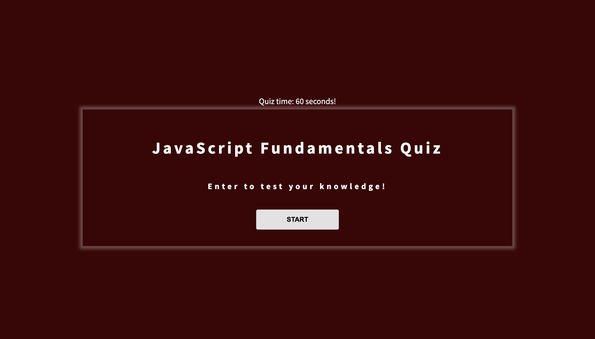

# 4-CODE-QUIZ

In this project I have used HTML as the baseline layout, styled it with CSS and dynamically created elements through JaveScript and made it user interactive to record the answers in the local storage for the user top view at the end of the quiz. The contains a countdown timer which when finished will end the quiz and render the form. the scores are recorded in the local storage of the webpage

Below is the screenshot of the webpage and The live link to the website: https://github.com/zaydsaid1/4-code-quiz

